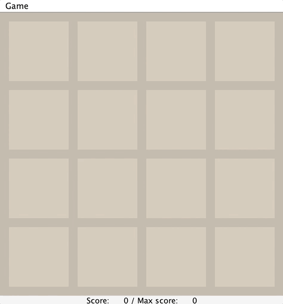

# 2048

In order to run this repo, compile all .java files and start the program from main. Please make sure you the JDK compiler installed.

This directory contains a skeleton for CS61B Project 0.

## Example GUI:

## CONTENTS

README.md              Information of the repository             

game2048/

    Main.java          Entry point to program. This handles program options
                       and sets up the necessary objects to play one or more
                       games.

    Model.java         This class describes game state: the contents of the
                       board and the scores.  It contains the logic for
                       tilting the board so that tiles slide to new positions.

    Tile.java          Describes a single tile on the board.

    Side.java          An enumeration type for the directions in which the
                       board can tilt.  Contains functions that allow you to
                       change the coordinate system---to treat any side of
                       the board as "south" with rows and columns rotated
                       accordingly.

    Game.java          Contains the logic for controlling a game: responding
                       to commands by updating the model as appropriate.

    InputSource.java   An interface to get input to the game, which consists of
                       keystrokes and random tile positions.  It has two
                       implementing subtypes: GUISource and TestSource.

    GUISource.java     An InputSource that fetches inputs from a user's
                       key presses and generates tiles using a
                       pseudo-random number generator (PRNG).

    TestSource.java    An InputSource that fetches recorded key presses and
                       tile positions from a file, allowing you to create
                       and run tests.

    GUI.java           Represents the graphical display of the game state and
                       receives key presses from the user.  The GUI
                       "observes" the model and responds to changes in it.

    BoardWidget.java   Used by GUI to represent the grid of squares and tiles.

    BoardLogger.java   Another observer of the game state that prints the
                       states of the board to a file, thus allowing one to
                       capture and check the board positions generated by
                       the program.
